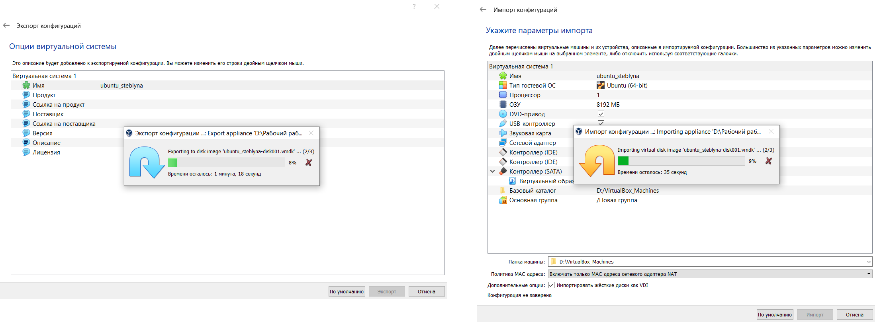
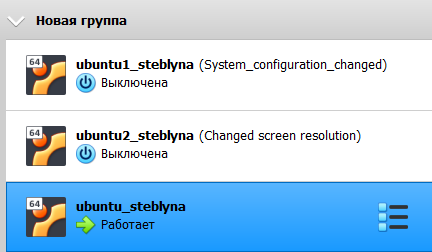

# Report task 2.1

**Dmytro Steblyna**

## PART 1. The most popular hypervisors and the main differences between them:

**There are 2 different types of hypervisors that can be used for virtualization.**  

 
<br />
<p align="center">
  
</p>


**Type 1:** a hypervisor is on bare metal. VM resources are scheduled directly to the hardware by the hypervisor. 

- VMware vSphere Hypervisor
- Microsoft Hyper-V
- Citrix XenServer
- KVM

**Type 2:** a hypervisor is hosted. VM resources are scheduled against a host operating system, which is then executed against the hardware.

- Oracle VirtualBox
- VMware Workstation Pro
- Parallels
- Qemu

**One of the best features of Type 1 hypervisors is that they allow for over-allocation of physical resources.**
With Type 1 hypervisors, you can assign more resources to your virtual machines than you have available. For example, if your server has 64 GB of RAM and 8 VMs, you can assign 12 GB of RAM to each of them. This totals to 96 GB of RAM, but the virtual machines themselves will not actually consume all 12 GB from the physical server. The VMs think they have 12 GB, when in reality they only use the amount of RAM they need to perform certain tasks.


## PART 2. WORK WITH VIRTUALBOX

**1. First run VirtualBox and Virtual Machine (VM).** 

Firstly, I downloaded VirtualBox, installed Ubuntu on it, and got acquainted with the possibilities of managing a virtual machine.


Then I cloned this virtual machine and created a group of two machines. Groups enable us to manage and perform functions on VMs collectively, as well as individually.

For VM1, I installed updates and VirtualBox drivers, created some files, added some images, and changed the background. 

Changing the state of the VM, I took several different snapshots, forming a branched tree of snapshots. The way snapshots work is very similar to how Git works.

I exported VM1 and saved it as the ubuntu_steblyna.ova file. Then I created a new VM by importing the ubuntu_steblyna.ova file.


**2. Configuration of virtual machines** 

I explored VM configuration options (like general settings, system settings, display, storage, audio, network and etc.).
Then I configured the USB to connect a USB flash drive on the host machine to the VM.

Also, I configured a shared folder to exchange data between the virtual machine and the host.  

For correct access I had to add myself to the shared folders group in the Ubuntu guest. I did it by running the command:
```sh
sudo adduser $USER vboxsf
```

**3. Work with CLI through VBoxManage.** 

I opened the cmd command line and executed basic VBoxManage commands like list, showvminfo, createvm, startvm, modifyvm, clonevm, snapshot, controlvm. Here are screenshots of the execution of some of the commands.


## PART 3. WORK WITH VAGRANT
