# Report task 2.2

**Dmytro Steblyna**

## Firstly, I registered an AWS Free Tier account. Then I started an Amazon Linux VM with Amazon Lightsail and connected to it.

## Launched another Linux VM without Amazon Lightsail. I used an instance of t2.micro and an Amazon Linux 2.0 operating system.

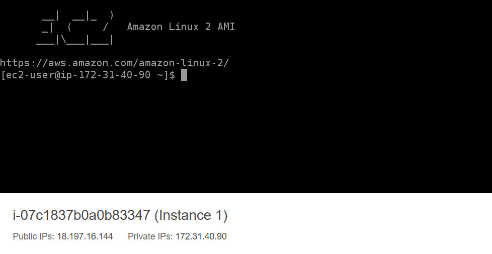

## Then I created a snapshot of the EC2 VM.

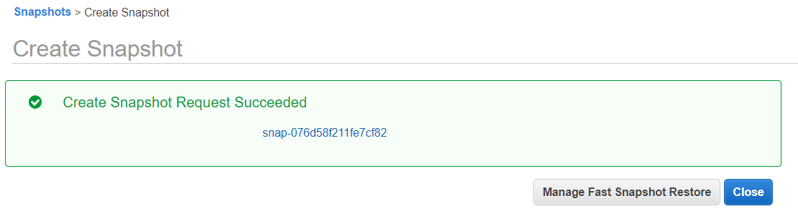

## Created and attached a Disk_D (EBS) to the instance to add more storage space. 

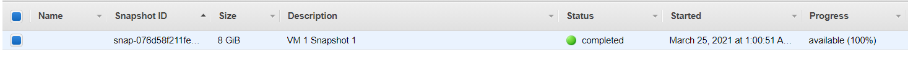

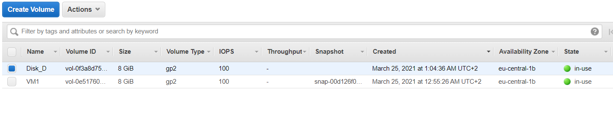

**I used the following commands to initially connect the disk to the system.**

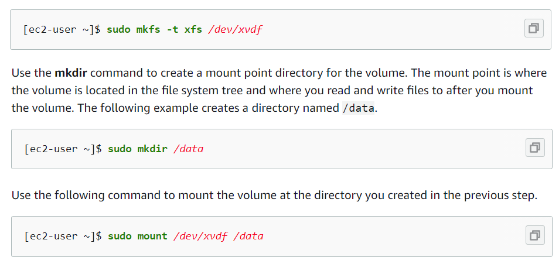

## Created and saved some file on Disk_D

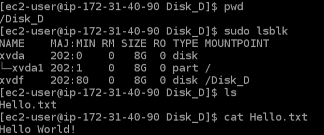

## Created an image from the snapshot and launched a new instance

## Detached Disk_D from the instance and attached it to the new instance (created from the snapshot)

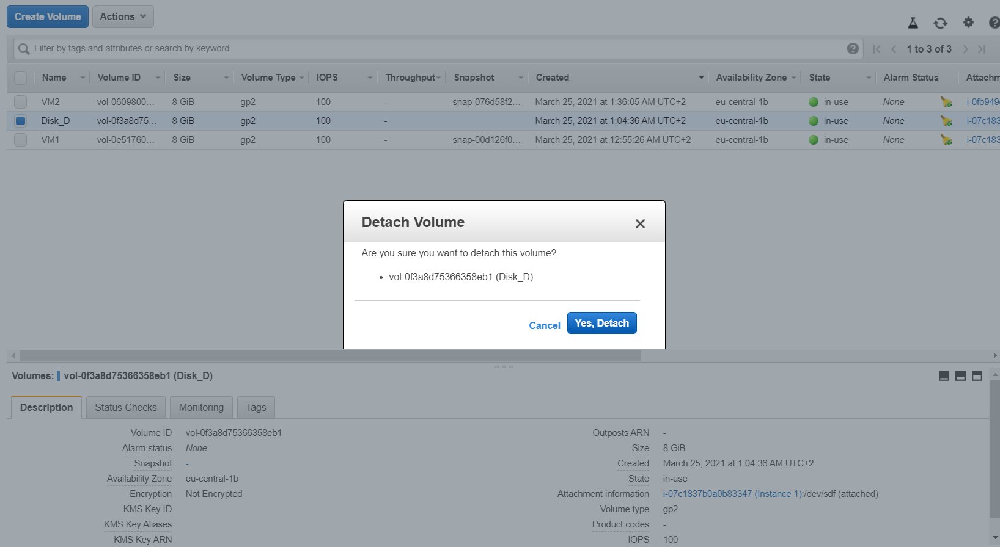

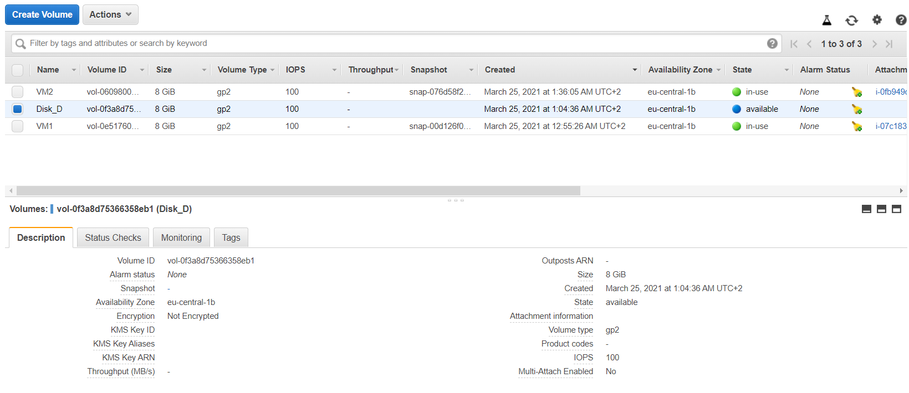

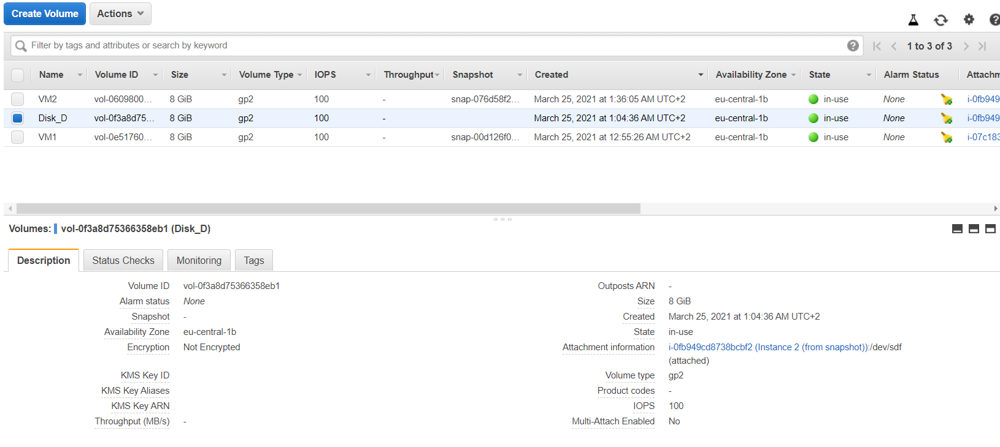

## Launched and configured a WordPress instance with Amazon Lightsail

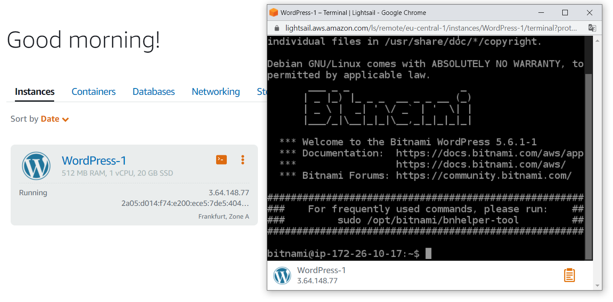

## Created a S3 Bucket, stored and retrieved some file.

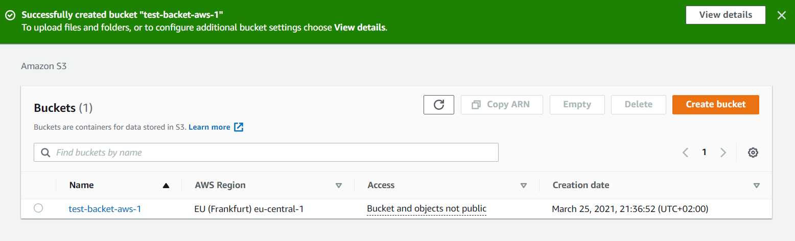

## Created a user AWS IAM, configured CLI AWS and uploaded a file to S3. 

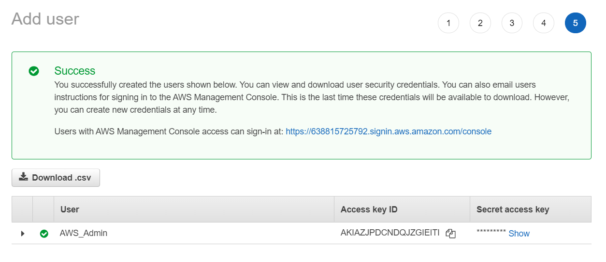

##  Elastic Container Service
**I created a container (based on the demo application), a cluster, and a service. And then started the application. Also, updated the task several times.**

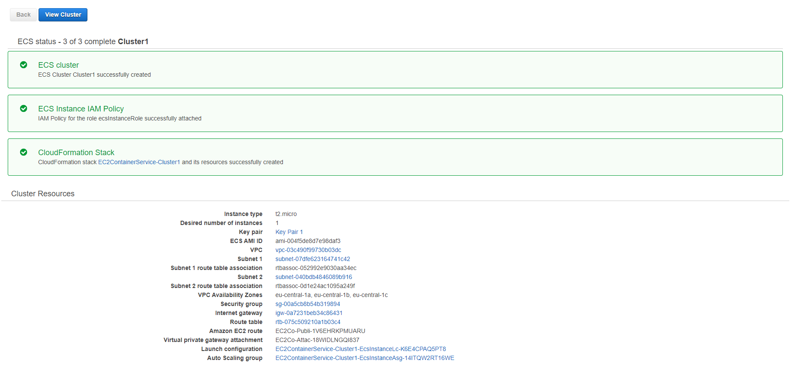

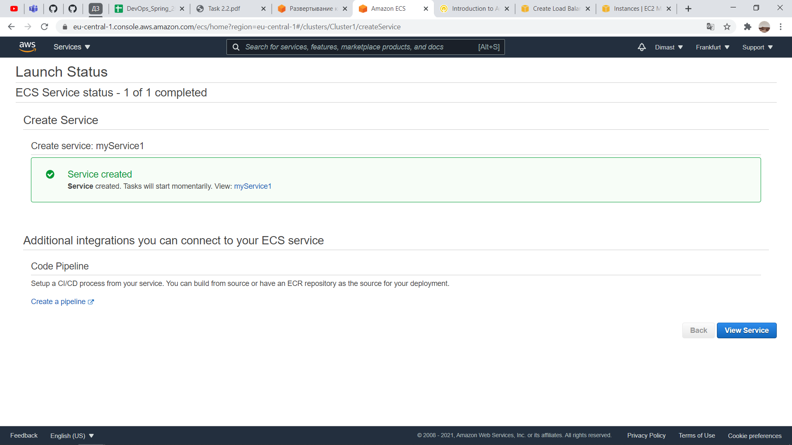

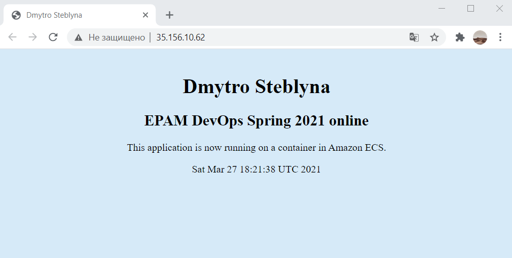

___

## Then I created the S3 static web-page: 
http://dmytro-steblyna.ml.s3-website.eu-central-1.amazonaws.com

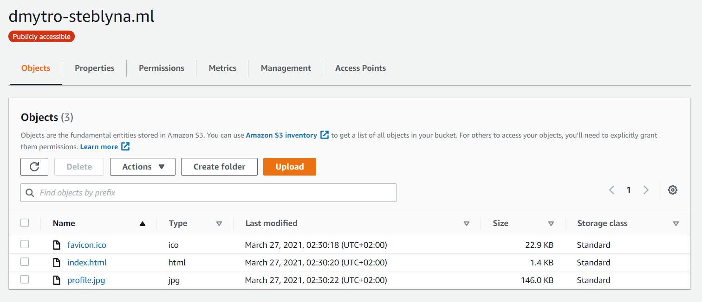

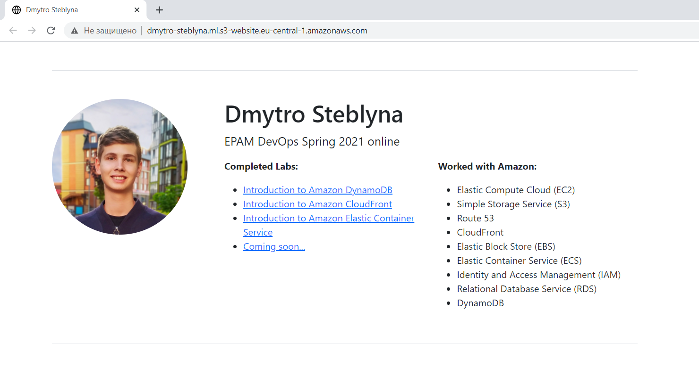

## Also I created a Hosted zone and connected my domain using Route 53 and checked for availability:

**Then I deleted the Hosted zone to avoid unexpected expenses.**

