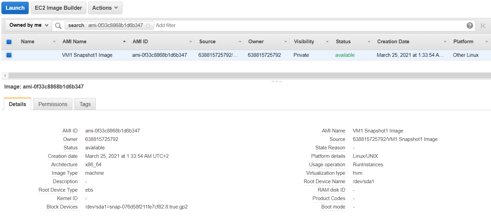
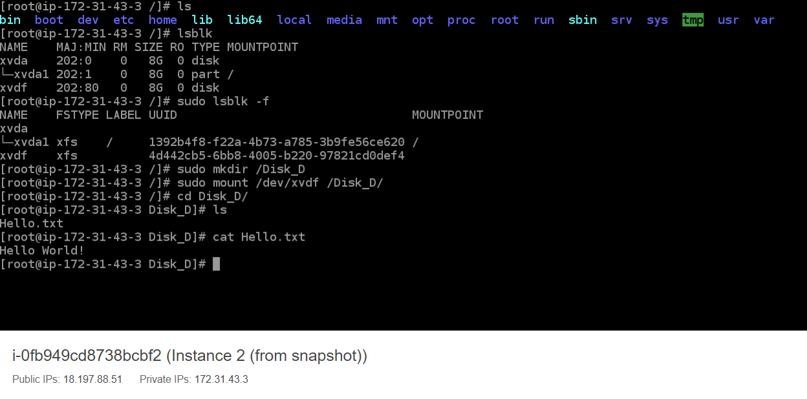
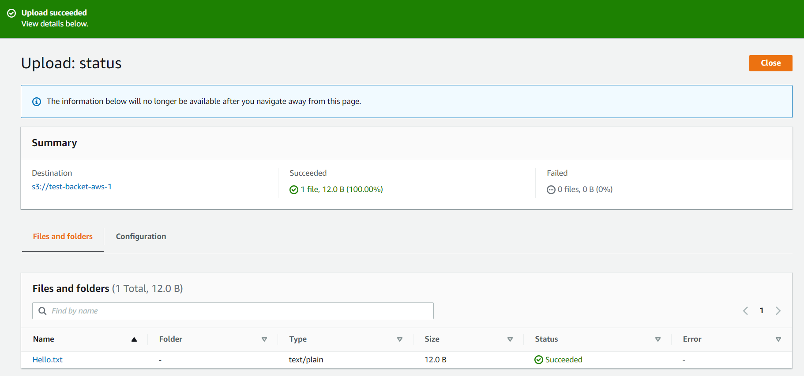
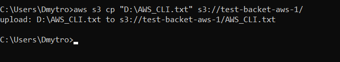
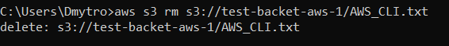

# Report task 2.2

**Dmytro Steblyna**

First, I signed up for an AWS Free Tier account. Then I started an Amazon Linux VM with Amazon Lightsail and connected to it.

Launched another Linux VM without Amazon Lightsail. I used an instance of t2.micro and an Amazon Linux operating system.

Then I created a snapshot of a virtual machine (no Lightsail).

Now finishing the report and the final tasks...
