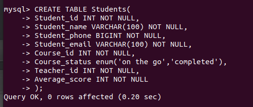
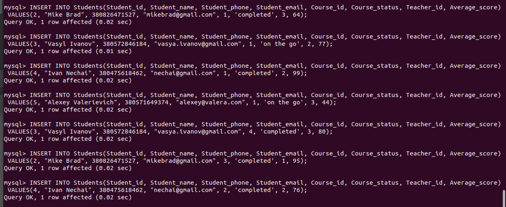
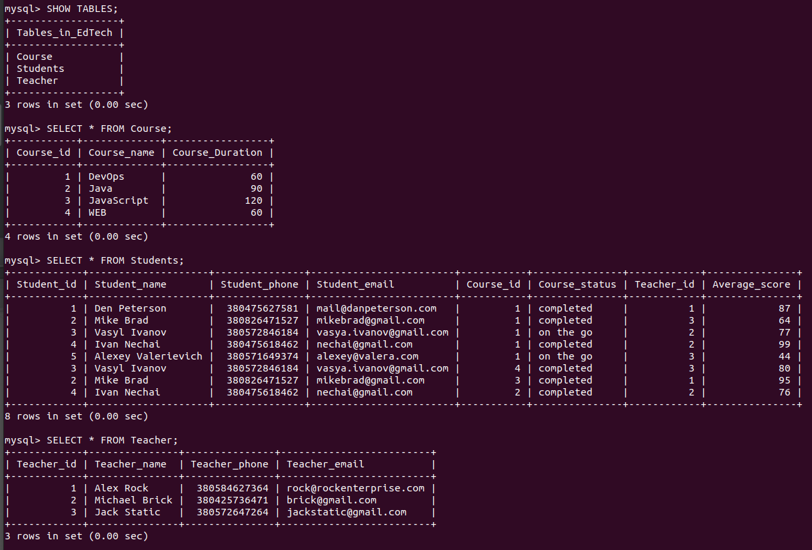
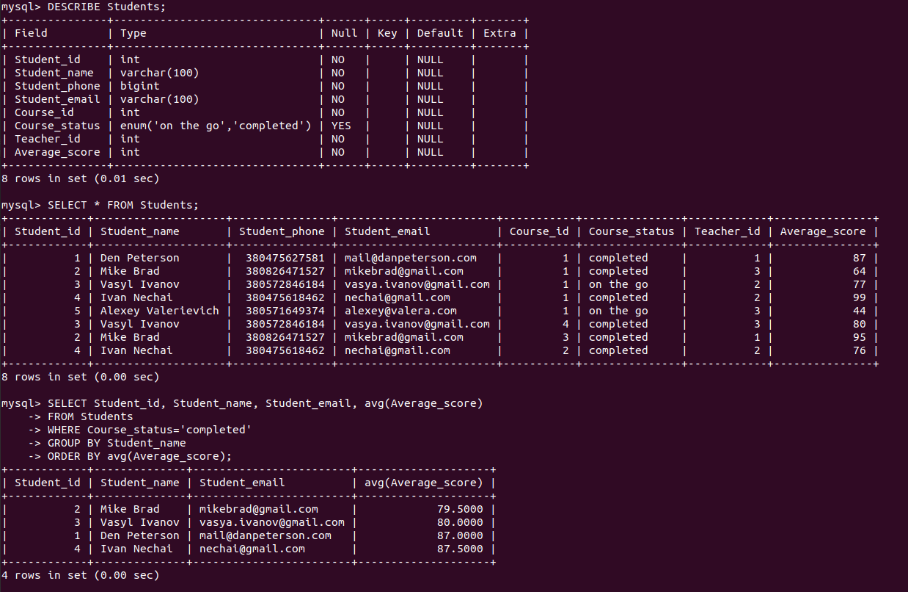
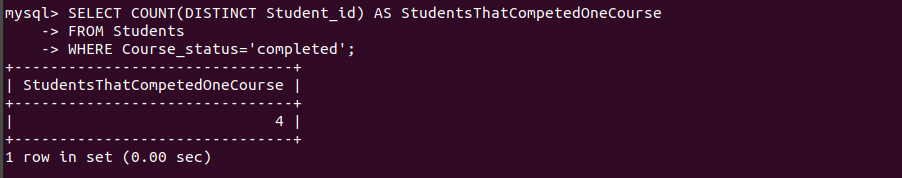
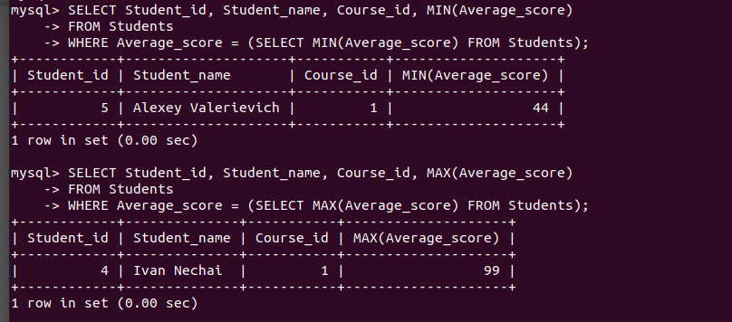
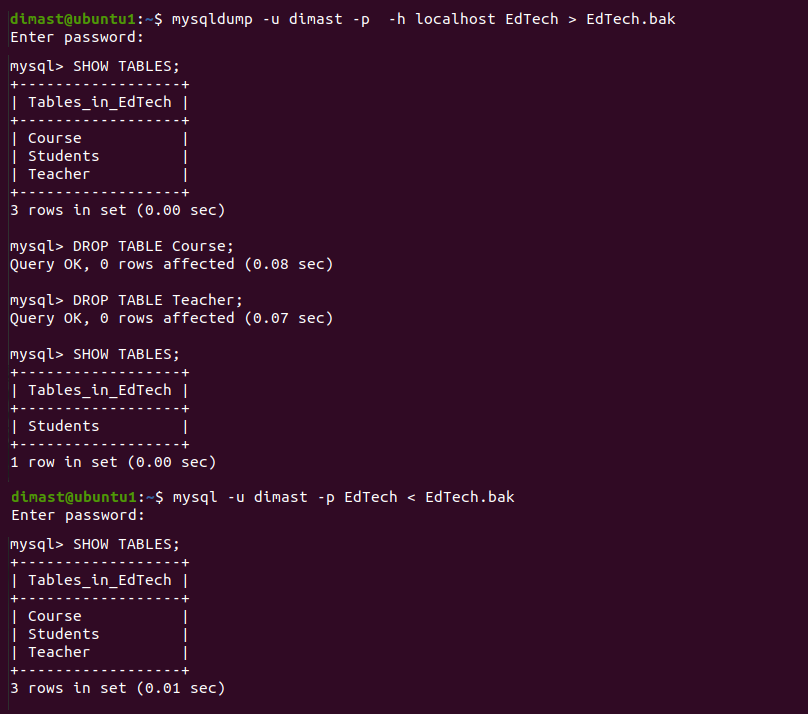

# Report task 3.1

**Dmytro Steblyna**

# PART 1

## The database schema.

## Firstly, I created a DB called "EdTech".

## Then I created 3 tables. And filled them with some data.

## I constructed and executed SELECT operator with FROM, WHERE, GROUP BY, and ORDER BY.

## Some other SQL queries.

**Let's count the number of students who have completed at least one course:**

**Let's find the best and worst students:**

(Finishing the report)

# PART 2

## I made backup of my database, deleted two tables and then restored my DB from the backup.

# PART 3

## Creating an Amazon DynamoDB table:

## Entering some data into the table:

## Querying the table using Query:

## Querying the table using Scan:

