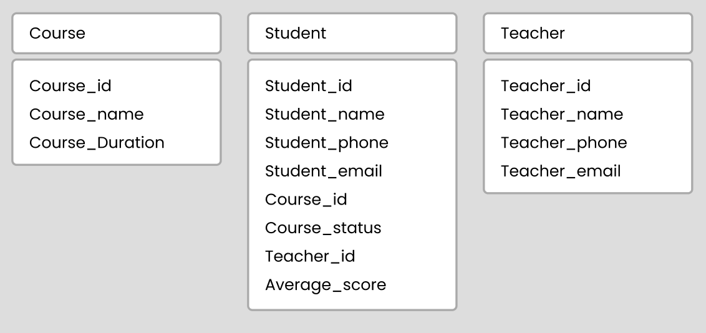

# Report task 3.1

**Dmytro Steblyna**

# PART 1

## The database schema.

## Firstly, I created a DB, Then tables.

# PART 2
(Finishing the report)

# PART 3

## Creating an Amazon DynamoDB table:

## Entering some data into the table:

## Query the table using Query:

## Query the table using Scan:

