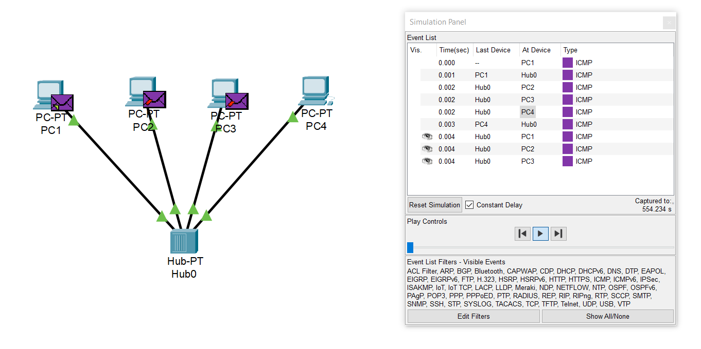
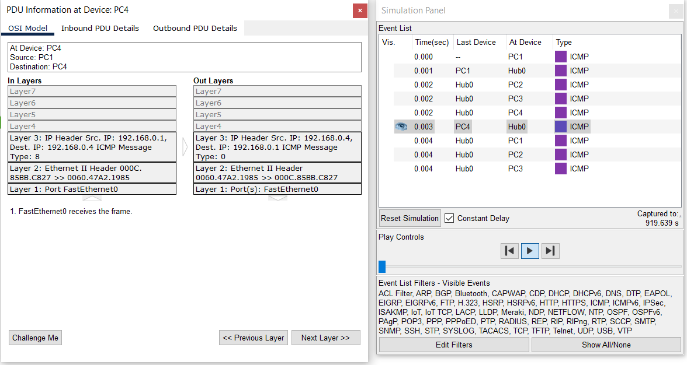
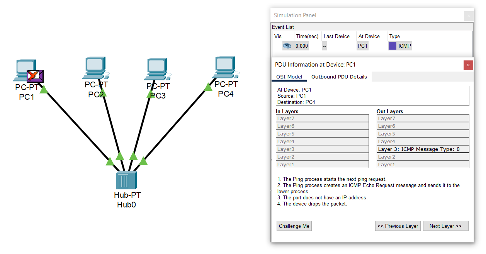
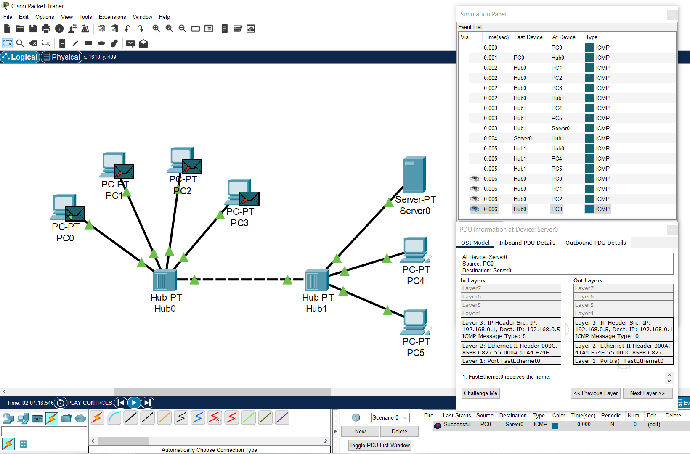
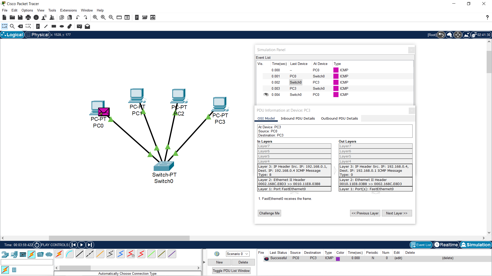
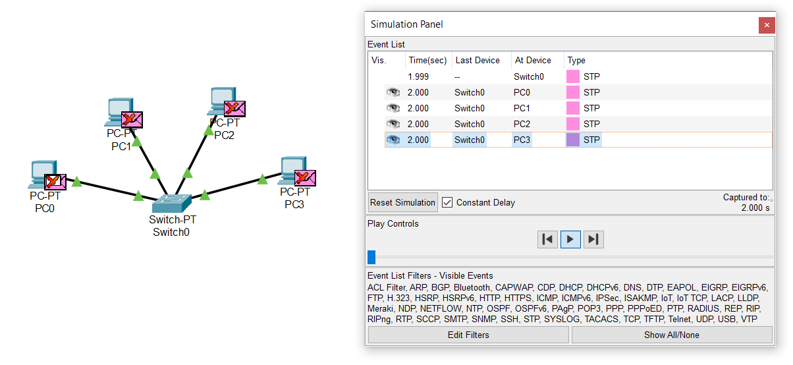
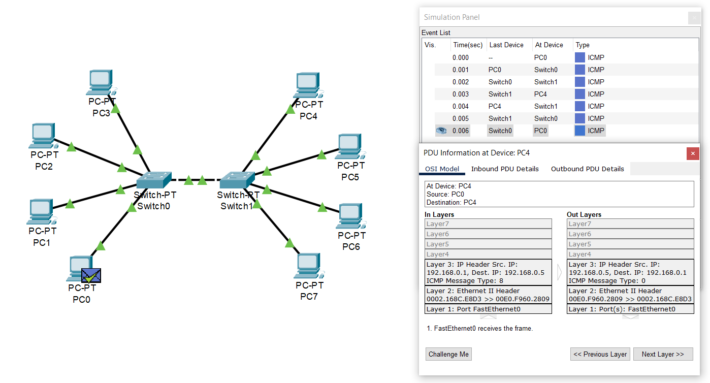
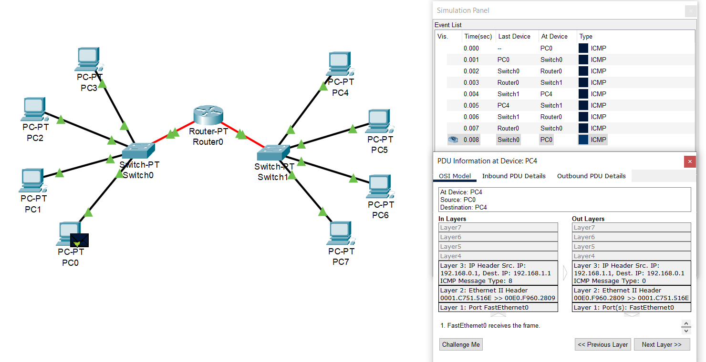

# Report task 4.1.

**Module 4. Networking Fundamentals**
**Dmytro Steblyna**

**I created a project with 4 computers and a hub. Assigned an IP to each computer. Checked the network functionality and traced packets.**

**Then I deleted the IP addresses for all computers. Tested the network. As a result, the network cannot work without IP addresses.**

**I also created a network that consists of two hubs and more computers. And checked the network functionality.**

**Next, I created a project with 4 computers and a switch. Assigned an IP to each computer, and checked the network functionality.**

**After deleting the IP addresses for all computers, the network also cannot work.**

**So, we see that a hub sends packets to all clients in the hope that one of them will accept it. When the switch sends packets only to the client to whom they are addressed. The switch loads the network less and provides a more secure connection.**

**Then I created a network that consists of two switches and 8 computers. And checked the network functionality.**

**I divided the previous network into two subnets, and connected them with a router. Also, checked the network functionality.**

**A router allows us to create several subnets within the network. Data can be exchanged between computers that are on different networks. When switches allow computers to communicate within one network.**
