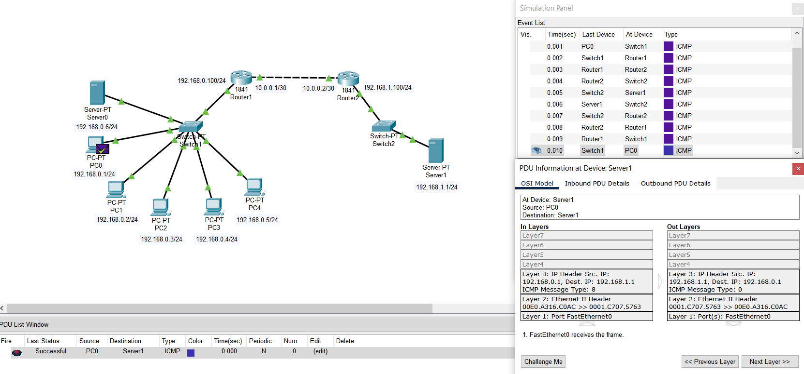
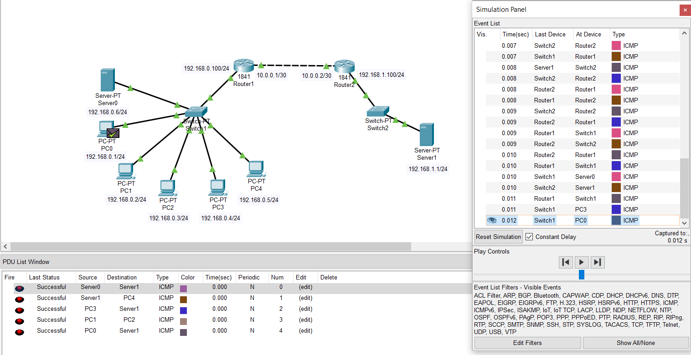

# Task 4.3 
**Module 4. Networking Fundamentals**

**Dmytro Steblyna**

- **I created a local network in which there are two routers configured using the RIP protocol. In the first subnet, I placed 5 computers and one server. The second subnet contains just I server.**

- **After configuration, I checked the ability to transfer data via ICMP between different objects on the network.**

