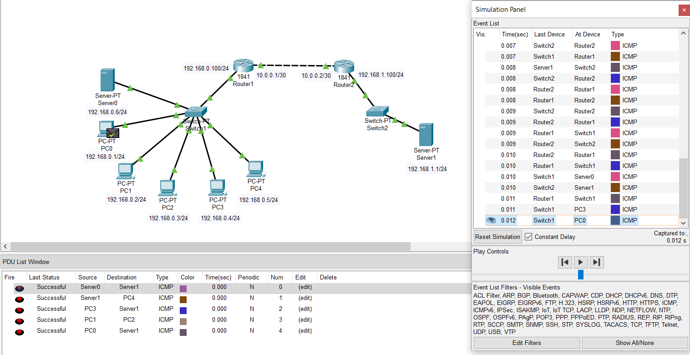

# Task 4.4 (BONUS) 
**Module 4. Networking Fundamentals**

**Dmytro Steblyna**

# Part 1
- **This task I already completed  in Task 4.3.**
(Here's a screenshot again just in case)

# Part 2
- **Here I created 2 subnets and configured DNS.**

