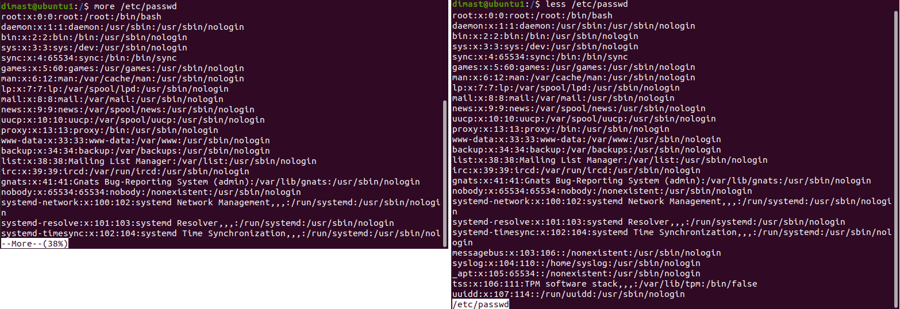

# Task 5.1
**Dmytro Steblyna**

# Part 1

# 1-2 Log in to the system as root. Use the passwd command to change the password. Examine the basic parameters of the command. What system file does it change?

**The ```passwd``` command changes the "/etc/passwd" file that contains information about the users on the system.**
<p></p>


# 3) Determine the users registered in the system, as well as what commands they execute. What additional information can be gleaned from the command execution?
<p></p>

# 4) Change personal information about yourself.**
<p></p>

# 5)Become familiar with the Linux help system and the man and info commands. Get help on the previously discussed commands, define and describe any two keys for these commands. Give examples.
<p></p>

# 6) Explore the more and less commands using the help system. View the contents of files .bash* using commands.
<p></p>

# 7) Describe in plans that you are working on laboratory work 1. Tip: You should read the documentation for the finger command.
<p></p>

# 8)List the contents of the home directory using the ls command, define its files and directories. Hint: Use the help system to familiarize yourself with the ls command.
<p></p>

# Part 2
# 1)Examine the tree command. Master the technique of applying a template, for example, display all files that contain a character c, or files that contain a specific sequence of characters. List subdirectories of the root directory up to and including the second nesting level.

**(Will finishing by the deadline)**
