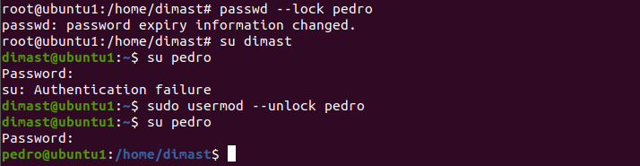
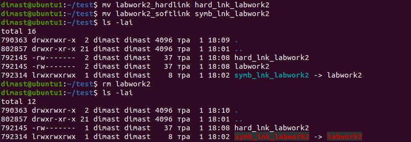
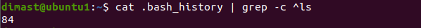

# Task 5.1
**Dmytro Steblyna**

# Part 1

# 1-2 Log in to the system as root. Use the passwd command to change the password. Examine the basic parameters of the command. What system file does it change?

**The ```passwd``` command changes the "/etc/passwd" file that contains information about the users on the system.**
<p></p>


# 3) Determine the users registered in the system, as well as what commands they execute. What additional information can be gleaned from the command execution?

**We can use the ```w``` command:**
<p></p>

**The header displays the following fields:**
- current time,
- system uptime without rebooting (uptime),
- the number of users currently working,
- the average value of the system load for the last 1, 5 and 15 minutes (Load averages).

**The following fields are displayed in the table for each user:**
- USER is the username.
- TTY is the name of the terminal.
- FROM is the name of the remote computer or IP address.
- LOGIN is the time of logging into the system.
- IDLE - idle time.
- JCPU is the time used by all processes connected to the tty. It does not include completed background jobs, but it does include background jobs that are currently running.
- PCPU is the time used by the current process, which is specified in the WHAT field.
- WHAT is the current process (command line of the current process).


# 4) Change personal information about yourself.
**Let's use the ```usermod [options] username``` command to change some information about the user:**
<p></p>

**Options:**
- -c = We can add comment field for the useraccount.
- -d = To modify the directory for any existing user account.
- -e = Using this option we can make the account expiry in specific period.
- -g = Change the primary group for a User.
- -G = To add a supplementary groups.
- -a = To add anyone of the group to a secondary group.
- -l = To change the login name from tecmint to tecmint_admin.
- -L = To lock the user account. This will lock the password so we can’t use the account.
- -m = moving the contents of the home directory from existing home dir to new dir.
- -p = To Use un-encrypted password for the new password. (NOT Secured).
- -s = Create a Specified shell for new accounts.
- -u = Used to Assigned UID for the user account between 0 to 999.
- -U = To unlock the user accounts. This will remove the password lock and allow us to use the user account.

# 5)Become familiar with the Linux help system and the man and info commands. Get help on the previously discussed commands, define and describe any two keys for these commands. Give examples.
<p></p>


**We can use ```w -h -s``` to display the result of ```w``` command without the header and in short format:**

<p></p>

**We can use ```usermod username -c "Some comment/info"``` to change the comment field in the "/etc/passwd" file:**

<p></p>

# 6) Explore the more and less commands using the help system. View the contents of files .bash* using commands.

**```more``` is one of the oldest terminal pagers in the UNIX ecosystem. Originally, ```more``` could only scroll down, but now we can use it to scroll up one screen-full at a time, and scroll down either one line or one screen-full. On its status bar, ```more``` shows the percentage of the file read. It automatically closes when it reaches the end of the file without having to press a button.**

**```more``` has many interactive commands like:**
- space – to go to the next page in accordance with the terminal’s size
- b – to go back one page
- enter – to scroll down one line
- = – to display the current line number
- :v – to start up the vi text editor at the current line

**One of to the reasons why ```less``` was introduced was to allow backward movement line by line. It has a lot of commands that are similar to the vi text editor’s commands, and it - supports horizontal scrolling, live monitoring, and more.**

<p></p>

# 7) Describe in plans that you are working on laboratory work 1. Tip: You should read the documentation for the finger command.
<p></p>

# 8)List the contents of the home directory using the ls command, define its files and directories. Hint: Use the help system to familiarize yourself with the ls command.
<p></p>

# Part 2
# 1) Examine the tree command. Master the technique of applying a template, for example, display all files that contain a character c, or files that contain a specific sequence of characters. List subdirectories of the root directory up to and including the second nesting level. 
<p></p>

# 2) What command can be used to determine the type of file (for example, text or binary)? Give an example. 
**We can use ```file [filename]``` command. The output of this command not only displays the type of the specified file but also shows the type of content stored in the specified file.**
<p></p>

# 3) Master the skills of navigating the file system using relative and absolute paths. How can you go back to your home directory from anywhere in the filesystem? 
**We can use ```cd /~``` command to go back to your home directory from anywhere.**
<p></p>

# 4) Become familiar with the various options for the ls command. Give examples of listing directories using different keys. Explain the information displayed on the terminal using the -l and -a switches. 
<p></p>

# 5) Perform the following sequence of operations: 
- create a subdirectory in the home directory; 
- in this subdirectory create a file containing information about directories located in the root directory (using I/O redirection operations); 
- view the created file; 
- copy the created file to your home directory using relative and absolute addressing. 
- delete the previously created subdirectory with the file requesting removal; 
- delete the file copied to the home directory. 

<p></p>

# 6) Perform the following sequence of operations: 
- create a subdirectory test in the home directory; 
- copy the .bash_history file to this directory while changing its name to labwork2; 
- create a hard and soft link to the labwork2 file in the test subdirectory; 

<p></p>

- **how to define soft and hard link, what do these concepts; **

- change the data by opening a symbolic link. What changes will happen and why 

<p></p>

- rename the hard link file to hard_lnk_labwork2;
- rename the soft link file to symb_lnk_labwork2 file;
- then delete the labwork2. What changes have occurred and why? 

<p></p>

# 7) Using the locate utility, find all files that contain the squid and traceroute sequence. 
<p></p>

# 8) Determine which partitions are mounted in the system, as well as the types of these partitions. 
**```df -aTh```**

<p></p>

# 9) Count the number of lines containing a given sequence of characters in a given file. 
**Count the number of lines starting at ls in a bash_history file.**
<p></p>


# 10) Using the find command, find all files in the /etc directory containing the host character sequence. 
<p></p>

# 11) List all objects in /etc that contain the ss character sequence. How can I duplicate a similar command using a bunch of grep? 
<p></p>

# 12) Organize a screen-by-screen print of the contents of the /etc directory. Hint: You must use stream redirection operations.
<p></p>

# 13) What are the types of devices and how to determine the type of device? Give examples.
**The first bit on each line of ```ls``` command denotes the type of file.**

**Device files are denoted as the following:

c - character device
b - block device
p - pipe device
s - socket device

- **Character Device - transfers data, but one a character at a time. These devices aren't really physically connected to the machine, but they allow the operating system greater functionality.**

- **Block Device - transfers data, but in large fixed-sized blocks; harddrives, filesystems, etc.**

- **Pipe Device - allows two or more processes to communicate with each other, these are similar to character devices, but instead of having output sent to a device, it's sent to another process.**

- **Socket Device - facilitates communication between processes, similar to pipe devices but they can communicate with many processes at once.**

<p></p>

# 14) How to determine the type of file in the system, what types of files are there? 
<p></p>

- Regular files ('-')
- Directory files ('d')
- Special files (5 types)
- Block file('b')
- Character device file('c')
- Named pipe file or just a pipe file('p')
- Symbolic link file('l')
- Socket file('s')

# 15) * List the first 5 directory files that were recently accessed in the /etc directory.
<p></p>

