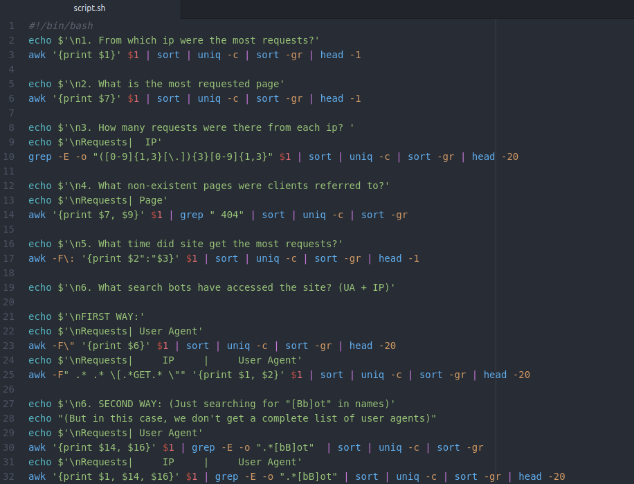

# B. Using Apache log example create a script to answer the following questions:

1. From which ip were the most requests?
2. What is the most requested page?
3. How many requests were there from each ip?
4. What non-existent pages were clients referred to?
5. What time did site get the most requests?
6. What search bots have accessed the site? (UA + IP)

**For convenience, I implemented all 6 tasks in one script. If needed, it can be split into 6 separate scripts.**

